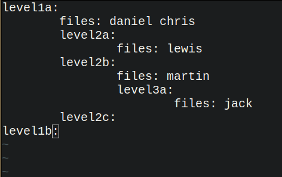
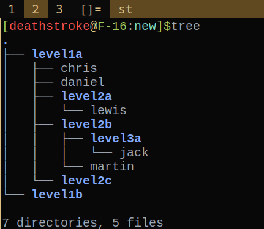

# filemaker

**filemaker: Automation program for files and directories creation**

Author: Sasidharssan A

This commandline program takes input from a text file for automating files and directory creation. 
For example, let us consider a input file as given in below image,




if we pass the input file path as commandline argument

```
  filemaker.sh input
```


it will create the files and directories in the present working directory as
shown in below imge



